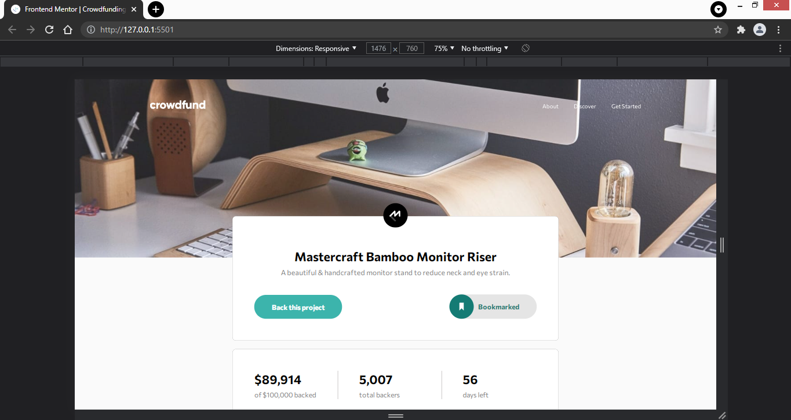
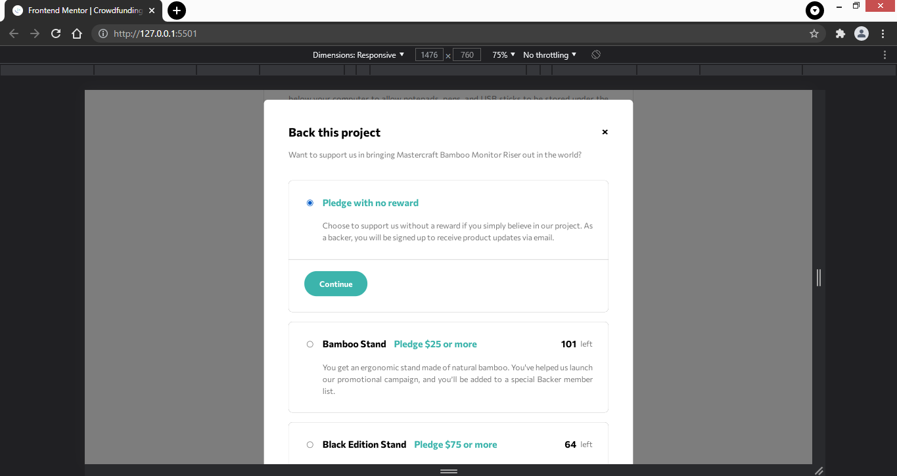
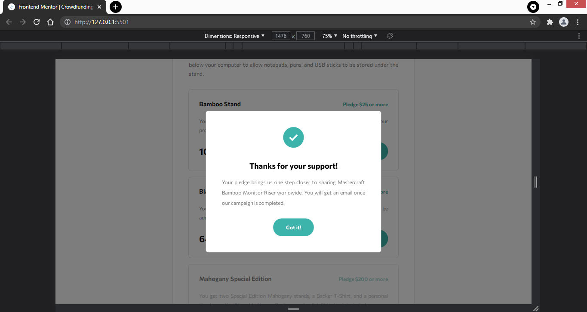
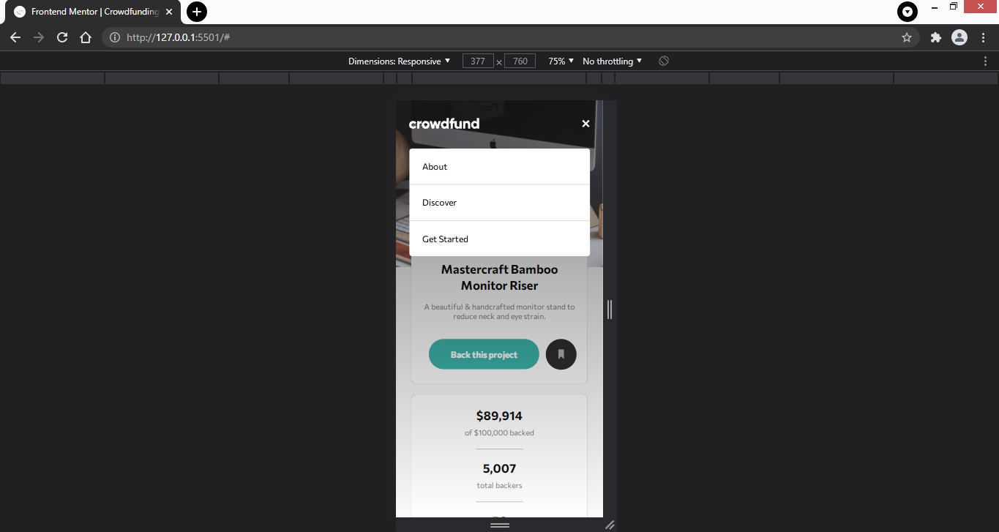
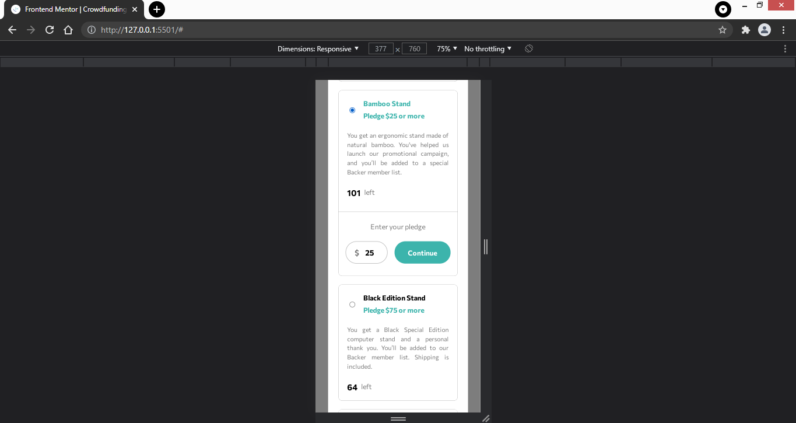

# Frontend Mentor - Crowdfunding product page solution

This is a solution to the [Crowdfunding product page challenge on Frontend Mentor](https://www.frontendmentor.io/challenges/crowdfunding-product-page-7uvcZe7ZR). Frontend Mentor challenges help you improve your coding skills by building realistic projects. 

## Table of contents

- [Overview](#overview)
  - [The challenge](#the-challenge)
  - [Screenshot](#screenshot)
  - [Links](#links)
- [My process](#my-process)
  - [Built with](#built-with)
  - [What I learned](#what-i-learned)
- [Author](#author)
- [Acknowledgments](#acknowledgments)

## Overview

### The challenge

Users should be able to:

- View the optimal layout depending on their device's screen size
- See hover states for interactive elements
- Make a selection of which pledge to make
- See an updated progress bar and total money raised based on their pledge total after confirming a pledge
- See the number of total backers increment by one after confirming a pledge
- Toggle whether or not the product is bookmarked

### Screenshot

## My process

### Built with

- Semantic HTML5 markup
- SCSS
- Flexbox
- Mobile-first workflow

### What I learned

This challenge was fun. I got to learn a lot. I got to hang around with the basic javascript to make the things visible and hide based on the user actions. This way I got to explore a lot, building and organizing different sections of the webpages.

## Author

- Frontend Mentor - [@harshj11](https://www.frontendmentor.io/profile/harshj11)

## Acknowledgments

I am grateful to freeCodeCamp and Jessica from [@thecodercoder](https://www.twitter.com/thecodercoder). Thank you so much freeCodeCamp and Jessica for telling about this beautiful platform: Frontend Mentor. I got to know about this platform from freeCodeCamp's video in which Jessica completed the whole challenge from Frontend Mentor. 

I must say Jessica is a good teacher and I got to learn a lot from her videos.

After following that challenge, I thought to complete a challenge on my own and in the end I was able to complete the challenge.

FrontEnd mentor is an awesome platform to build real world projects. Thankyou so much FrontEnd mentor. This is really an awesome platform to hone your skills. Keep up the good work :clap: